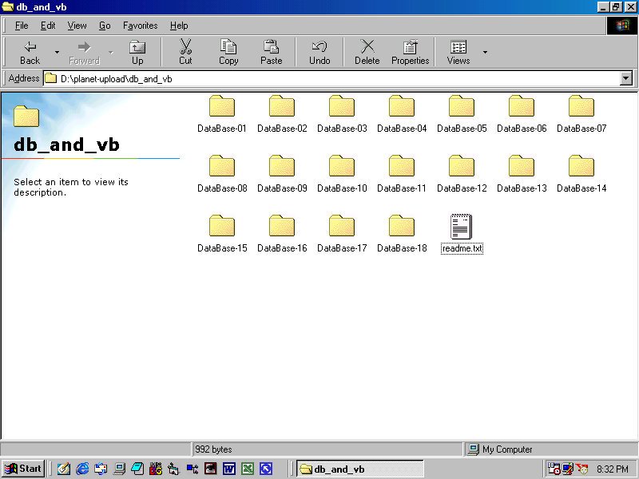



## DB &amp; VB \[tutorial\]

### Description

[By_ Shahin Noursalehi Contact: admin@MixofTix.net]

Happy New Year! There are 18 step by step article/applications about how to contact

databases (M.S. Access [*.MDB] as default)... unfortunately there is no

comments inside , but so simple to understand!!!

These samples are useful for beginners in VB...(Any feedbacks welcome)
 
### More Info
 

             |
---                |---
**Submitted On**   |2005-12-24 21:34:18
**By**             |[SerweX](https://github.com/Planet-Source-Code/PSCIndex/blob/master/ByAuthor/serwex.md)
**Level**          |Beginner
**User Rating**    |5.0 (10 globes from 2 users)
**Compatibility**  |VB 6\.0
**Category**       |[Complete Applications](https://github.com/Planet-Source-Code/PSCIndex/blob/master/ByCategory/complete-applications__1-27.md)
**World**          |[Visual Basic](https://github.com/Planet-Source-Code/PSCIndex/blob/master/ByWorld/visual-basic.md)
**Archive File**   |[DB\_&\_VB\_\[t196112112006\.zip](https://github.com/Planet-Source-Code/serwex-db-amp-vb-tutorial__1-63872/archive/master.zip)

